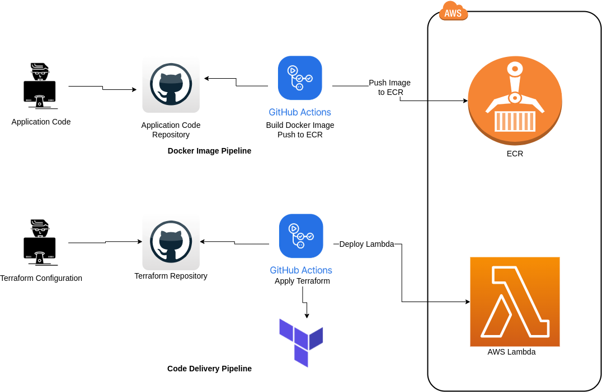

# AWS Lambda CICD

This repositoy contains the Python code for AWS Lambda layers. 

## File Structure

1. `myapp` folder contains `app.py` file having Python cofe and Dockerfile to build the docker image.
2. `common` folder contains `requirements.txt` file which contains name of Python libraries.
3. `.github` folder contains GitHub Action workflow file which will build the docker image and push the image to ECR.

## Authenticating to AWS

Set the Acess key and secret key in the GitHub Action secrets with key as following.
```
AWS_ACCESS_KEY_ID:  ATDJKSSCXHGSJAXXXX
AWS_SECRET_ACCESS_KEY: 678ygshGD765rhsbvdwdhsg87
```

## Quick start

1. Go to Actions section.
2. Click on `Run workflow`
3. Input the values as per your need.
4. Run the workflow.

## Workflow Diagram


